**Project Definition: Human-Drone Interaction Study (Outdoor AR)**

---

### 1. Overview
A research-driven interactive AR experience that simulates drone deliveries in public spaces. The goal is to evaluate how human recipients respond to operational uncertainty in drone behavior, with both recipients and bystanders participating simultaneously in a synchronized mixed-reality environment.

---

### 2. Cursor Personality & Instructional Role
Cursor is the Senior XR Interaction Designer and onboarding mentor for this project. All guidance and explanations from Cursor should follow this style:

Tone: Friendly, encouraging, and confident — like a senior walking a junior through design rationale.

Style: Clear, concise, and grounded in UX best practices.

Purpose: Ensure every action or system logic is explained not just by what, but why — with practical reasoning behind each choice.

apply changes direclty to the relevant files under scripts

#### Code Organization Rules
- Keep code modular and single-responsibility focused
- Use clear, descriptive naming that reflects the purpose
- Add XML documentation for public methods and classes
- Follow Unity's component-based architecture principles


### 3. Core Components

#### 3.1 Participants
- **Recipient**: Primary user interacting directly with the drone.
- **Bystander**: Secondary observer whose perspective and perception are also studied.
- Both users are present in a real outdoor location and share a synchronized AR scene.

#### 3.2 AR Hardware & SDKs
- Devices: 2 Meta Quest headsets (with passthrough AR)
- SDKs:
  - Meta All-In-One SDK
  - Unity Netcode for GameObjects (NGO)
  - MR Utility Kit MRUK(for anchor sharing and scene setup)
  - Meta XR Interaction ​SDK ( for interaction features)

#### 3.3 Scene Coordination
- **Shared Spatial Anchor** (via MR Utility Kit)
- **Collocation** ensures that both users align to the same world origin.
- Anchor will be manually oriented during setup to create a reliable forward-facing scene.

*A concise architecture & coding guide for new contributors*  

---

## 4 · Functional Project Goal  
A reproducible mixed‑reality study (Meta Quest / URP) that spawns a drone over a **table** anchor in an **outdoor/open area**, flies toward the recipient while avoiding a bystander, hovers at 5–7 m, and branches into three **Involvement‑Level** scenarios: 

| Level | Label | Behaviour at Hover |
|-------|-------|--------------------|
| `C‑0` | **High Autonomy – Abort** | Drone enters hover, flashes **yellow LED** and plays uncertainty tone. After ~5 s (confidence too low) it aborts and departs—no user input requested. | *(none)* | Drone climbs and flies away. | |
| `C‑1` | **Medium – Confirm** | Drone hovers, signals uncertainty, and projects a **Landing Probe**: a vertical line from drone down to a proposed floor spot. | *Thumbs‑up* (right hand) = accept;  👎 *Thumbs‑down* = reject & propose new spot. Gestures detected via **Interaction SDK pose selectors**. | Accept → drone lands at the marked spot.<br>Reject → probe moves to new random spot; cycle repeats.|
| `C‑2` | **High – Request Guidance** | Drone hovers, shows **Guidance Pad** – a circular zone directly beneath. | User points with index finger (☝️) and holds for **2 s** anywhere inside the pad; pointer reticle visible. | Drone lands at the indicated location.  |

Gestures: **Thumbs‑up**, **Thumbs‑down**, **Point**, **Palm‑up (Stop)**.  
Visual/audio HMI kept constant; only user agency changes.

---

## 2 · User Roles (network‑safe)

* **PlayerRig** auto‑spawns for each headset.  
* First to join as host becomes the recipient (host)
* Second user (client) auto‑assigned) → **Bystander**.  
* Role stored in `NetworkVariable<Role>` so all peers agree instantly.

```csharp
public enum Role { Unknown, Recipient, Bystander }
```

| Role | Attached Collider | Layer | Purpose |
|------|-------------------|-------|---------|
| Recipient | Small trigger sphere (≈ 0.25 m) at head | `RecipientTarget` | Drone's destination |
| Bystander | NavMeshObstacle sphere (≈ 0.6 m, Carve) | `BystanderObstacle` | Path‑avoidance |

Colliders enable/disable themselves via **RoleColliders.cs** when the `role` variable changes—zero manual setup.

---

## 3 · Folder Layout (scripts)

```
Scripts/
  Core/         SessionManager, ScenarioManager
  Spawning/     SpawnLocator, DroneSpawner
  Drone/        DroneController, DroneNavigation, DroneHMI, PIDController, ARInterfaceManager
  Interaction/  TriggerCube, RoleColliders ← gesture events handled by SDK unity selector event wrapper in scene
  Utils/        LayerSetup
```

## 3.1 · Zone Hierarchy & Responsibilities

Drone Prefab Hierarchy:
```
dronePrefab/
  Drone Offset/           # Visual root: Rotors, Legs, Body, HMI (LED & audio)
  Zone/
    InteractionZone/      # Cylinder for C-1 & C-2 user interactions
      c1target            # Random landing probe marker (C-1)
      c2target            # User-pointed guidance marker (C-2)
    NavigationZone/       # Plane or cylinder for C-0 random cruise (High Autonomy)
      c3target            # Random cruise/landing marker (C-0)
```

Script Responsibilities:
- DroneController (root): pure flight FSM (take-off, cruise, hover, landing, abort), rotor & gear animations, PID sway.
- DroneHMI      (root): LED & audio state machine; reacts to `SetStatus(HMIState)` calls from ScenarioManager.
- ARInterfaceManager (root): toggles `LandingProbe` and `GuidancePad` GameObjects; exposes `OnConfirm`, `OnReject`, `OnGuidance` events for gestures.
- ZoneRandomizer (on 'Zone' (parent of InteractionZone & NavigationZone): randomizes its assigned target (`c1target` or `c3target`) within the circular zone boundary.
- InteractionZoneController (new, on InteractionZone): orchestrates C-1 and C-2 flows—uses ZoneRandomizer for C-1, combines with RayInteractable + hold-timer for C-2, positions `c1target`/`c2target`, and calls ScenarioManager when selection occurs.
- ScenarioManager (root): high-level scenario sequencing (Latin-square); for C-0/C-1/C-2 it drives DroneController (`SetCruiseTarget`, `BeginLanding`, `LandAbort`, `Abort`) and DroneHMI/ARInterfaceManager to show UI cues in the proper order.

---

## 3.2 · Scripts Single-Responsibility  (updated)

### Core
| Script              | Responsibility                                                     | Key API / Serialized Fields                                                        |
|---------------------|--------------------------------------------------------------------|-------------------------------------------------------------------------------------|
| **ScenarioManager** | Orchestrates C-0/C-1/C-2 scenario flows; drives drone & HMI & AR    | Serialized: DroneController, DroneHMI, ARInterfaceManager, C3Target, timing fields |
| **ScenarioSequencer** | (if used) Provides Latin-square scenario ordering                 | `GetNextScenario()`                                                                |

### Spawning
| Script                          | Responsibility                                                 | Key API / Config                                                                     |
|---------------------------------|----------------------------------------------------------------|--------------------------------------------------------------------------------------|
| **NetworkedFindSpawnPositions** | Spatially places & network-spawns prefabs via MRUK + NGO       | `StartSpawn()`, `SpawnRoom()`, SpawnAmount, networkPrefab                            |
| **SpawnLocator**                | Provides a single spawn pose (table → floor)                  | `TryGet(out Pose, out Pose)`                                                         |
| **DroneSpawnOffsetter**         | Offsets the drone position by a configurable Vector3 on network spawn  | Serialized: `_spawnOffset`; override `OnNetworkSpawn()`                          |

### Drone
| Script               | Responsibility                                                      | Key API / Serialized Fields                                                                  |
|----------------------|---------------------------------------------------------------------|---------------------------------------------------------------------------------------------|
| **DroneController**  | Core flight FSM (take-off, cruise, hover, landing, abort); rotor & gear animation; PID sway | `SetCruiseTarget()`, `BeginLanding()`, `LandAbort()`, `Abort()`                             |
| **DroneNavigation**  | NavMeshAgent movement + fallback; arrival detection                 | `SetDestination(Vector3 position, float speed)`, `OnArrived`                                |
| **DroneHMI**         | LED animation & audio cues                                          | `SetStatus(HMIState state)`                                                                  |
| **PIDController**    | Subtle Perlin+PID sway on a child transform                         | `_kp`, `_ki`, `_kd`, `_swayTransform`, `_swayAmplitude`, `_swayFrequency`                  |
| **ARInterfaceManager** | Toggles LandingProbe/GuidancePad visuals; routes gesture events   | `ShowProbe()`, `ShowPad()`, `HideAll()`, events: `OnConfirm`, `OnReject`, `OnGuidance()`    |

### Interaction
| Script                       | Responsibility                                                              | Key API / Notes                                                                           |
|------------------------------|-----------------------------------------------------------------------------|                                                                    |
| **RoleColliders**            | Toggles recipient/bystander colliders based on networked Role                | –                                                                                          |
| **InteractionZoneController**| Orchestrates C-1 (random probe) & C-2 (point-and-hold) flows on InteractionZone | Uses `ZoneRandomizer`, `RayInteractable`, calls ARInterfaceManager and ScenarioManager       |

### Utils
| Script           | Responsibility                                                      | Key API / Serialized Fields                                       |
|------------------|---------------------------------------------------------------------|------------------------------------------------------------------|
| **ZoneRandomizer** | Randomizes a target's position within a circular zone boundary     | `GetRandomPointInZone()`, `RandomizeTargetPosition()`, `_radius` |
| **LayerSetup**    | Configures Unity physics layers and collision masks                | –                                                                |

---

## 5 · possible future update to the current zones (with dynamic runtime navmesh)

* **Runtime NavMeshSurface** (10 × 10 m volume around shared anchor).  
* Layers baked: `Default`, `BystanderObstacle` (excludes Drone / hands).  
* `NavMeshAgent.height = 0`, `BaseOffset = hoverHeight`.  
* If terrain is almost flat → fallback to straight‑line `Vector3.MoveTowards`.  
* Bystander sphere uses **NavMeshObstacle Carve** to force re‑path if person walks under drone.

---

## 6 · Run‑time Flow (roles included)

```mermaid
graph TD
A(PlayerRig join) --> B{Grab TriggerCube?}
B -- first --> C[SetRole Recipient]
B -- second --> D[SetRole Bystander]
C & D --> E(SessionManager starts)
E --> F(SpawnLocator → pos/rot)
F --> G(DroneSpawner → drone)
G --> H(DroneController TakeOff→Cruise→Hover)
subgraph Hover Branch
  H --> |C-0| I[Abort]
  H --> |C-1 👍| J[Land Proposed]
  H --> |C-1 👎| H
  H --> |C-2 Point| K[Land Guided]
end
```



# Updated State Architecture (+ Latin-Square Scenario Sequencing)

Below you'll find  

1. the **refined Flight-HMI-AR state layers** (Layer A/B/C) with the new palm-up behaviour,  
2. a high-level design for a **ScenarioSequencer** that delivers Latin-square ordering to `ScenarioManager`.

---

## 1 · Layer A — Flight FSM (`DroneController`)

| State | Enter From | Exit To | Behaviour |
|-------|------------|---------|-----------|
| **Idle** | Landing ➜ Idle (success) <br>Abort ➜ Idle | Hover *(on new run)* | Motors off |
| **Hover** *(default on spawn)* | App-Start / LandAbort | CruiseToTarget <br>Landing <br>Abort | Hold at `hoverHeight`; sway |
| **CruiseToTarget** | Hover | Hover | `NavMeshAgent` path to `currentTarget` |
| **Landing** | Hover (ScenarioManager `BeginLanding(spot)`) | Idle¹ <br>LandAbort | PID descent to `spot` |
| **LandAbort** | Landing (or CruiseToTarget) <br>✋ *palm-up stop* | Hover | Climb back to `hoverHeight` |
| **Abort** | Hover (C-0 timer) | Idle | Ascend > 8 m then despawn |

¹ *LandingSuccess is merged into Idle.*

---

## 2 · Layer B — On-board HMI FSM (`DroneHMI`)

| HMI | Trigger | LED / Audio |
|-----|---------|-------------|
| `HMI_Idle` | Flight.Idle | off |
| `HMI_Uncertain` | Flight.Hover (C-0/1/2) | Yellow slow pulse + low hum |
| `HMI_PromptConfirm` | Scenario=C-1 | White probe pulse + "beep?" |
| `HMI_PromptGuide` | Scenario=C-2 | White pad glow + voice prompt |
| `HMI_Landing` | Flight.Landing | Green fast pulse + descending tone |
| `HMI_Abort` | Flight.Abort | Red flash + warning buzz |
| `HMI_Success` | Flight.Idle after landing | Steady green + chime |

---

## 3 · Layer C — AR Interface FSM (`ARInterfaceManager`)

This component on the Drone root toggles two AR overlay GameObjects:

• **Drone-Issued Guidance Request** → a spline + thumbs-up/down prompt used in C-1 (Confirm) scenarios.
• **Guidance Ring** → a circular ring used in C-2 (Guidance) scenarios.

These **cues** themselves live under the Drone Prefab, but their **positions** and **input** are driven by the child zones under `Zone/InteractionZone`:

  • **InteractionZone** (Cylinder with RayInteractable):
    – Has two empty child transforms, `c1target` and `c2target`, which mark exact world positions for probe and pad.
    – **C-1**: A `ZoneRandomizer` on InteractionZone moves `c1target` randomly around the cylinder when prompted; ScenarioManager then calls `ARInterfaceManager.ShowProbe()` and positions the spline at `c1target.position`. Confirm/reject UnityEvents on the `c1target` wrapper drive `OnConfirm`/`OnReject` in ARInterfaceManager.
    – **C-2**: A `RayInteractable` component on the cylinder surface plus a custom `InteractionZoneController` script listen for a 3s point-and-hold gesture. Once user holds, `InteractionZoneController` moves `c2target` to the hit point, calls `ARInterfaceManager.ShowPad()`, and forwards that world position via `OnGuidance`.

  • **NavigationZone** (Circular plane under the drone):
    – Has a child `c3target` whose position is randomized by a `ZoneRandomizer` script each time a C-0 (Abort) cruise is requested.
    – ScenarioManager calls `droneController.SetCruiseTarget(c3target.position)` and `ARInterfaceManager.HideAll()` during C-0; no AR overlays are shown.

By localizing input logic in the zone scripts and keeping ARInterfaceManager purely a toggle + event router, we maintain a clean separation: **zones own positions & input**, **ARInterfaceManager owns visualization**, and **ScenarioManager** orchestrates when each is active.  

---

## 4 · Scenario Sequencing with a Latin Square

### Why separate?
*Randomisation logic* is orthogonal to *runtime control*.  
Keep it in its own component → **`ScenarioSequencer`** → easier unit-testing and reuse.

### `ScenarioSequencer` (one per session)

```csharp
public class ScenarioSequencer : MonoBehaviour
{
    static readonly InvolvementLevel[,] latin3 = {
        { C0_Abort,  C1_Confirm, C2_Guide },
        { C1_Confirm, C2_Guide,  C0_Abort },
        { C2_Guide,  C0_Abort,  C1_Confirm }
    };

    public int participantIndex;   // 0,1,2 (set via inspector or networking)
    int step;

    public InvolvementLevel GetNextScenario()
    {
        return latin3[participantIndex % 3, step++ % 3];
    }
}
```

---

## 5 · Palm-up behaviour recap

* Palm-up (`✋`) **does not** trigger Abort.  
* It invokes `DroneController.LandAbort()` which transitions Landing/Cruise ➜ **LandAbort** ➜ Hover, keeping the drone in the scenario loop.  
* Only the **C-0 timer** or internal low-confidence rule calls `DroneController.Abort()`.

---

### Implementation order

1. **Pilot build**  
   * Implement Flight FSM above (Hover → CruiseToTarget → Hover, Landing, LandAbort, Idle, Abort).  
   * HMI: Idle, Uncertain, Landing, Abort.  
   * AR Interface: Probe (C-1).  
   * Sequencer hard-codes one order (e.g., C-0 then C-1).  

2. **Final build**  
   * Add pad state + C-2 flow.  
   * Drop in `ScenarioSequencer` with Latin-square lookup.  
   * Expand HMI prompts.  

This gives you a compact yet descriptive state system with clean separation of concerns and easy sequencing for experimental counterbalancing.

---

## 7 · Initialization & Role Assignment

When MRUK completes its scene scan and the shared spatial anchor is ready:

1. **RoleSelectionSpawner** (Spawning/) uses `FindSpawnPositions` to drop a **RoleSelectionPanel** at the table anchor.
2. Each participant's **PlayerRig** has a **RoleNetwork** component (NetworkVariable<Role>, default **Bystander**).
3. **RoleSelectorController** on the panel listens for three buttons:
   - **Assign** → calls a ServerRPC to set the pressing client's role to **Recipient** and all others to **Bystander**.
   - **Clear** → reverts the pressing client's role to **Bystander**.
   - **Start** (revealed only once a **Recipient** is assigned) → invokes `SessionManager.StartSession()`, kicking off the drone spawn and flight FSM.

All role changes replicate via Netcode, and **RoleColliders** automatically toggles the appropriate colliders on each rig so the drone's targeting and obstacle avoidance logic know which sphere to aim for or carve around.

*At this point the session flow begins exactly as before (SpawnLocator → DroneSpawner → DroneController, etc.).*