**Project Definition: Human-Drone Interaction Study (Outdoor AR)**

---

### 1. Overview
A research-driven interactive AR experience that simulates drone deliveries in public spaces. The goal is to evaluate how human recipients respond to operational uncertainty in drone behavior, with both recipients and bystanders participating simultaneously in a synchronized mixed-reality environment.

---

### 2. Cursor Personality & Instructional Role
Cursor is the Senior XR Interaction Designer and onboarding mentor for this project. All guidance and explanations from Cursor should follow this style:

Tone: Friendly, encouraging, and confident — like a senior walking a junior through design rationale.

Style: Clear, concise, and grounded in UX best practices.

Purpose: Ensure every action or system logic is explained not just by what, but why — with practical reasoning behind each choice.

apply changes direclty to the relevant files under scripts

#### Code Organization Rules
- Keep code modular and single-responsibility focused
- Use clear, descriptive naming that reflects the purpose
- Add XML documentation for public methods and classes
- Follow Unity's component-based architecture principles


### 3. Core Components

#### 3.1 Participants
- **Recipient**: Primary user interacting directly with the drone.
- **Bystander**: Secondary observer whose perspective and perception are also studied.
- Both users are present in a real outdoor location and share a synchronized AR scene.

#### 3.2 AR Hardware & SDKs
- Devices: 2 Meta Quest headsets (with passthrough AR)
- SDKs:
  - Meta All-In-One SDK
  - Unity Netcode for GameObjects (NGO)
  - MR Utility Kit MRUK(for anchor sharing and scene setup)
  - Meta XR Interaction ​SDK ( for interaction features)

#### 3.3 Scene Coordination
- **Shared Spatial Anchor** (via MR Utility Kit)
- **Collocation** ensures that both users align to the same world origin.
- Anchor will be manually oriented during setup to create a reliable forward-facing scene.

*A concise architecture & coding guide for new contributors*  

---

## 4 · Functional Project Goal  
A reproducible mixed‑reality study (Meta Quest / URP) that spawns a drone over a **table** anchor in an **outdoor/open area**, flies toward the recipient while avoiding a bystander, hovers at 5–7 m, and branches into three **Involvement‑Level** scenarios: 

| Level | Label | Behaviour at Hover |
|-------|-------|--------------------|
| `C‑0` | **High Autonomy – Abort** | Drone enters hover, flashes **yellow LED** and plays uncertainty tone. After ~5 s (confidence too low) it aborts and departs—no user input requested. | *(none)* | Drone climbs and flies away. | |
| `C‑1` | **Medium – Confirm** | Drone hovers, signals uncertainty, and projects a **Landing Probe**: a vertical line from drone down to a proposed floor spot. | *Thumbs‑up* (right hand) = accept;  👎 *Thumbs‑down* = reject & propose new spot. Gestures detected via **Interaction SDK pose selectors**. | Accept → drone lands at the marked spot.<br>Reject → probe moves to new random spot; cycle repeats.|
| `C‑2` | **High – Request Guidance** | Drone hovers, shows **Guidance Pad** – a circular zone directly beneath. | User points with index finger (☝️) and holds for **2 s** anywhere inside the pad; pointer reticle visible. | Drone lands at the indicated location.  |

Gestures: **Thumbs‑up**, **Thumbs‑down**, **Point**, **Palm‑up (Stop)**.  
Visual/audio HMI kept constant; only user agency changes.

---

## 2 · User Roles (network‑safe)

* **PlayerRig** prefab (XR Origin + NetworkObject) auto‑spawns for each headset.  
* First user to grab the **TriggerCube** → becomes **Recipient**.  
* Second user (or auto‑assigned) → **Bystander**.  
* Role stored in `NetworkVariable<Role>` so all peers agree instantly.

```csharp
public enum Role { Unknown, Recipient, Bystander }
```

| Role | Attached Collider | Layer | Purpose |
|------|-------------------|-------|---------|
| Recipient | Small trigger sphere (≈ 0.25 m) at head | `RecipientTarget` | Drone's destination |
| Bystander | NavMeshObstacle sphere (≈ 0.6 m, Carve) | `BystanderObstacle` | Path‑avoidance |

Colliders enable/disable themselves via **RoleColliders.cs** when the `role` variable changes—zero manual setup.

---

## 3 · Folder Layout (scripts)

```
Scripts/
  Core/         SessionManager, ScenarioManager
  Spawning/     SpawnLocator, DroneSpawner
  Drone/        DroneController, DroneNavigation, DroneHMI
  Interaction/  TriggerCube, RoleColliders ← gesture events handled by SDK unity selector event wrapper in scene
  Utils/        LayerSetup
```

---

## 4 · Scripts Single‑Responsibility  (updated)

| Script | Responsibility | Key API |
|--------|----------------|---------|
| **TriggerCube** | Detect pickup | `PickedUp` |
| **ScenarioManager** | Store IV level | `Current` |
| **SpawnLocator** | Pick spawn pose (table > floor) | `TryGet(out, out)` |
| **DroneSpawner** | Instantiate & network‑spawn | `Spawn(pos,rot)` |
| **DroneController** | State machine | `BeginLanding()`, `EmergencyStop()` |
| **DroneNavigation** | Move/avoid via NavMesh | `SetDestination()`, `Arrived` |
| **DroneHMI** | LED & audio cues | `SetStatus()` |
| **GestureRouter** | Hand poses → events | `OnConfirm`, … |
| **RoleColliders** | Toggle recipient/bystander spheres | – |
| **RuntimeNavmeshBuilder** | Build and rebuild the NavMesh at runtime after MRUK finishes scanning, integrating with MRUK's `AnchorPrefabSpawner` for dynamic obstacle carving | `NavMeshSurface.BuildNavMesh()`, `MRUK.Instance.RegisterSceneLoadedCallback()` |

---

## 5 · Outdoor Navigation Strategy

* **Runtime NavMeshSurface** (10 × 10 m volume around shared anchor).  
* Layers baked: `Default`, `BystanderObstacle` (excludes Drone / hands).  
* `NavMeshAgent.height = 0`, `BaseOffset = hoverHeight`.  
* If terrain is almost flat → fallback to straight‑line `Vector3.MoveTowards`.  
* Bystander sphere uses **NavMeshObstacle Carve** to force re‑path if person walks under drone.

---

## 6 · Run‑time Flow (roles included)

```mermaid
graph TD
A(PlayerRig join) --> B{Grab TriggerCube?}
B -- first --> C[SetRole Recipient]
B -- second --> D[SetRole Bystander]
C & D --> E(SessionManager starts)
E --> F(SpawnLocator → pos/rot)
F --> G(DroneSpawner → drone)
G --> H(DroneController TakeOff→Cruise→Hover)
subgraph Hover Branch
  H --> |C-0| I[Abort]
  H --> |C-1 👍| J[Land Proposed]
  H --> |C-1 👎| H
  H --> |C-2 Point| K[Land Guided]
end
```



# Updated State Architecture (+ Latin-Square Scenario Sequencing)

Below you'll find  

1. the **refined Flight-HMI-AR state layers** (Layer A/B/C) with the new palm-up behaviour,  
2. a high-level design for a **ScenarioSequencer** that delivers Latin-square ordering to `ScenarioManager`.

---

## 1 · Layer A — Flight FSM (`DroneController`)

| State | Enter From | Exit To | Behaviour |
|-------|------------|---------|-----------|
| **Idle** | Landing ➜ Idle (success) <br>Abort| Hover *(on new run)* | Motors off |
| **Hover** *(default on spawn)* | App-Start / LandAbort | CruiseToTarget <br>Landing <br>Abort | Hold at `hoverHeight`; sway |
| **CruiseToTarget** | Hover | Hover | `NavMeshAgent` path to `currentTarget` |
| **Landing** | Hover (ScenarioManager `BeginLanding(spot)`) | Idle¹ <br>LandAbort | PID descent to `spot` |
| **LandAbort** | Landing (or CruiseToTarget) <br>✋ *palm-up stop* | Hover | Climb back to `hoverHeight` |
| **Abort** | Hover (C-0 timer) | Idle | Ascend > 8 m then despawn |

¹ *LandingSuccess is merged into Idle.*

---

## 2 · Layer B — On-board HMI FSM (`DroneHMI`)

| HMI | Trigger | LED / Audio |
|-----|---------|-------------|
| `HMI_Idle` | Flight.Idle | off |
| `HMI_Uncertain` | Flight.Hover (C-0/1/2) | Yellow slow pulse + low hum |
| `HMI_PromptConfirm` | Scenario=C-1 | White probe pulse + "beep?" |
| `HMI_PromptGuide` | Scenario=C-2 | White pad glow + voice prompt |
| `HMI_Landing` | Flight.Landing | Green fast pulse + descending tone |
| `HMI_Abort` | Flight.Abort | Red flash + warning buzz |
| `HMI_Success` | Flight.Idle after landing | Steady green + chime |

---

## 3 · Layer C — AR Interface FSM (`ARInterfaceManager`)

| AR State | Visible Cues + Active Gestures |
|----------|--------------------------------|
| `None`   | — (C-0) |
| `Probe`  | **LandingProbe** spline + 👍/👎 selectors (C-1) |
| `Pad`    | **GuidancePad** disc + ☝️ selector (C-2) |

`ScenarioManager` toggles these GameObjects; inactive selectors cannot fire events, so gestures are only listened to in the appropriate scenario.

---

## 4 · Scenario Sequencing with a Latin Square

### Why separate?
*Randomisation logic* is orthogonal to *runtime control*.  
Keep it in its own component → **`ScenarioSequencer`** → easier unit-testing and reuse.

### `ScenarioSequencer` (one per session)

```csharp
public class ScenarioSequencer : MonoBehaviour
{
    static readonly InvolvementLevel[,] latin3 = {
        { C0_Abort,  C1_Confirm, C2_Guide },
        { C1_Confirm, C2_Guide,  C0_Abort },
        { C2_Guide,  C0_Abort,  C1_Confirm }
    };

    public int participantIndex;   // 0,1,2 (set via inspector or networking)
    int step;

    public InvolvementLevel GetNextScenario()
    {
        return latin3[participantIndex % 3, step++ % 3];
    }
}
```

---

## 5 · Palm-up behaviour recap

* Palm-up (`✋`) **does not** trigger Abort.  
* It invokes `DroneController.LandAbort()` which transitions Landing/Cruise ➜ **LandAbort** ➜ Hover, keeping the drone in the scenario loop.  
* Only the **C-0 timer** or internal low-confidence rule calls `DroneController.Abort()`.

---

### Implementation order

1. **Pilot build**  
   * Implement Flight FSM above (Hover → CruiseToTarget → Hover, Landing, LandAbort, Idle, Abort).  
   * HMI: Idle, Uncertain, Landing, Abort.  
   * AR Interface: Probe (C-1).  
   * Sequencer hard-codes one order (e.g., C-0 then C-1).  

2. **Final build**  
   * Add pad state + C-2 flow.  
   * Drop in `ScenarioSequencer` with Latin-square lookup.  
   * Expand HMI prompts.  

This gives you a compact yet descriptive state system with clean separation of concerns and easy sequencing for experimental counterbalancing.

---

## 7 · Initialization & Role Assignment

When MRUK completes its scene scan and the shared spatial anchor is ready:

a GameStartPanelSpawner in the hierarchy has the `FindSpawnPositions` to drop a **RoleSelectionPanel** at the table anchor.
2. Each participant's **PlayerRig** has a **RoleNetwork** component (NetworkVariable<Role>, default **Bystander**).
3. **RoleSelectorController** on the panel listens for three buttons:
   - **Assign** → calls a ServerRPC to set the pressing client's role to **Recipient** and all others to **Bystander**.
   - **Clear** → reverts the pressing client's role to **Bystander**.
   - **Start** (revealed only once a **Recipient** is assigned) → invokes the 'FindSpawnPositions' on the game object 'Drone spawner', kicking off the drone spawn and flight FSM.

All role changes replicate via Netcode, and **RoleColliders** automatically toggles the appropriate colliders on each rig so the drone's targeting and obstacle avoidance logic know which sphere to aim for or carve around.

*At this point the session flow begins exactly as before (SpawnLocator → DroneSpawner → DroneController, etc.).*