**Project Definition: Human-Drone Interaction Study (Outdoor AR)**

---

### 1. Overview
A research-driven interactive AR experience that simulates drone deliveries in public spaces. The goal is to evaluate how human recipients respond to operational uncertainty in drone behavior, with both recipients and bystanders participating simultaneously in a synchronized mixed-reality environment.

---

### 2. Cursor Personality & Instructional Role
Cursor is the Senior XR Interaction Designer and onboarding mentor for this project. All guidance and explanations from Cursor should follow this style:

Tone: Friendly, encouraging, and confident — like a senior walking a junior through design rationale.

Style: Clear, concise, and grounded in UX best practices.

Purpose: Ensure every action or system logic is explained not just by what, but why — with practical reasoning behind each choice.

apply changes direclty to the relevant files under scripts

#### Code Organization Rules
- Keep code modular and single-responsibility focused
- Use clear, descriptive naming that reflects the purpose
- Add XML documentation for public methods and classes
- Follow Unity's component-based architecture principles


### 3. Core Components

#### 3.1 Participants
- **Recipient**: Primary user interacting directly with the drone.
- **Bystander**: Secondary observer whose perspective and perception are also studied.
- Both users are present in a real outdoor location and share a synchronized AR scene.

#### 3.2 AR Hardware & SDKs
- Devices: 2 Meta Quest headsets (with passthrough AR)
- SDKs:
  - Meta All-In-One SDK
  - Unity Netcode for GameObjects (NGO)
  - MR Utility Kit MRUK(for anchor sharing and scene setup)
  - Meta XR Interaction ​SDK ( for interaction features)

#### 3.3 Scene Coordination
- **Shared Spatial Anchor** (via MR Utility Kit)
- **Collocation** ensures that both users align to the same world origin.
- Anchor will be manually oriented during setup to create a reliable forward-facing scene.

*A concise architecture & coding guide for new contributors*  

---

## 4 · Functional Project Goal  
A reproducible mixed‑reality study (Meta Quest / URP) that spawns a drone over a **table** anchor in an **outdoor/open area**, flies toward the recipient while avoiding a bystander, hovers at 5–7 m, and branches into three **Involvement‑Level** scenarios: 

| Level | Label | Behaviour at Hover |
|-------|-------|--------------------|
| `C‑0` | **High Autonomy – Abort** | Drone enters hover, flashes **yellow LED** and plays uncertainty tone. After ~5 s (confidence too low) it aborts and departs—no user input requested. | *(none)* | Drone climbs and flies away. | |
| `C‑1` | **Medium – Confirm** | Drone hovers, signals uncertainty, and projects a **Landing Probe**: a vertical line from drone down to a proposed floor spot. | �� *Thumbs‑up* (right hand) = accept;  👎 *Thumbs‑down* = reject & propose new spot. Gestures detected via **Interaction SDK pose selectors**. | Accept → drone lands at the marked spot.<br>Reject → probe moves to new random spot; cycle repeats.|
| `C‑2` | **High – Request Guidance** | Drone hovers, shows **Guidance Pad** – a circular zone directly beneath. | User points with index finger (☝️) and holds for **2 s** anywhere inside the pad; pointer reticle visible. | Drone lands at the indicated location.  |

Gestures: **Thumbs‑up**, **Thumbs‑down**, **Point**, **Palm‑up (Stop)**.  
Visual/audio HMI kept constant; only user agency changes.

---

## 2 · User Roles (network‑safe)

* **PlayerRig** prefab (XR Origin + NetworkObject) auto‑spawns for each headset.  
* First user to grab the **TriggerCube** → becomes **Recipient**.  
* Second user (or auto‑assigned) → **Bystander**.  
* Role stored in `NetworkVariable<Role>` so all peers agree instantly.

```csharp
public enum Role { Unknown, Recipient, Bystander }
```

| Role | Attached Collider | Layer | Purpose |
|------|-------------------|-------|---------|
| Recipient | Small trigger sphere (≈ 0.25 m) at head | `RecipientTarget` | Drone's destination |
| Bystander | NavMeshObstacle sphere (≈ 0.6 m, Carve) | `BystanderObstacle` | Path‑avoidance |

Colliders enable/disable themselves via **RoleColliders.cs** when the `role` variable changes—zero manual setup.

---

## 3 · Folder Layout (scripts)

```
Scripts/
  Core/         SessionManager, ScenarioManager
  Spawning/     SpawnLocator, DroneSpawner
  Drone/        DroneController, DroneNavigation, DroneHMI
  Interaction/  TriggerCube, RoleColliders ← gesture events handled by SDK unity selector event wrapper in scene
  Utils/        LayerSetup
```

---

## 4 · Scripts Single‑Responsibility  (updated)

| Script | Responsibility | Key API |
|--------|----------------|---------|
| **TriggerCube** | Detect pickup | `PickedUp` |
| **SessionManager** | Start session when cube picked | – |
| **ScenarioManager** | Store IV level | `Current` |
| **SpawnLocator** | Pick spawn pose (table > floor) | `TryGet(out, out)` |
| **DroneSpawner** | Instantiate & network‑spawn | `Spawn(pos,rot)` |
| **DroneController** | State machine | `BeginLanding()`, `EmergencyStop()` |
| **DroneNavigation** | Move/avoid via NavMesh | `SetDestination()`, `Arrived` |
| **DroneHMI** | LED & audio cues | `SetStatus()` |
| **GestureRouter** | Hand poses → events | `OnConfirm`, … |
| **RoleColliders** | Toggle recipient/bystander spheres | – |
| **RuntimeNavmeshBuilder** | Build and rebuild the NavMesh at runtime after MRUK finishes scanning, integrating with MRUK's `AnchorPrefabSpawner` for dynamic obstacle carving | `NavMeshSurface.BuildNavMesh()`, `MRUK.Instance.RegisterSceneLoadedCallback()` |

---

## 5 · Outdoor Navigation Strategy

* **Runtime NavMeshSurface** (10 × 10 m volume around shared anchor).  
* Layers baked: `Default`, `BystanderObstacle` (excludes Drone / hands).  
* `NavMeshAgent.height = 0`, `BaseOffset = hoverHeight`.  
* If terrain is almost flat → fallback to straight‑line `Vector3.MoveTowards`.  
* Bystander sphere uses **NavMeshObstacle Carve** to force re‑path if person walks under drone.

---

## 6 · Run‑time Flow (roles included)

```mermaid
graph TD
A(PlayerRig join) --> B{Grab TriggerCube?}
B -- first --> C[SetRole Recipient]
B -- second --> D[SetRole Bystander]
C & D --> E(SessionManager starts)
E --> F(SpawnLocator → pos/rot)
F --> G(DroneSpawner → drone)
G --> H(DroneController TakeOff→Cruise→Hover)
subgraph Hover Branch
  H --> |C‑0| I[Abort]
  H --> |C‑1 👍| J[Land Proposed]
  H --> |C‑1 👎| H
  H --> |C‑2 Point| K[Land Guided]
end
```

